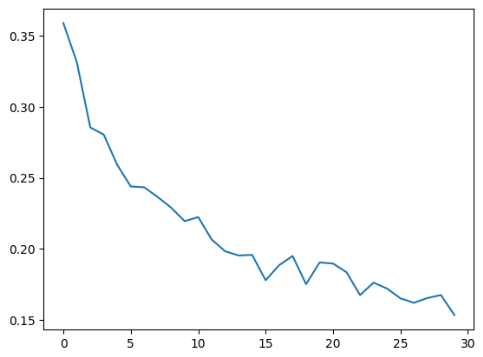
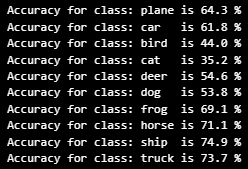

# Image Classification with Torch CNN #

## Installation ##
Ensure you have `Python>=3.6` installed on your machine.

Install python dependencies by running:
```
pip install -r requirements.txt
```

## Goal ##

My goal for this project was to build a Convolutional Neural Network with Torch, and train it as an image classifier. CIFAR-10 is a benchmark for image classification algorithms. it consists of roughly 60000 32x32 color images with 5000 training and 1000 testing images per class.

More information on the dataset can be found here https://paperswithcode.com/dataset/cifar-10

## Results ##

 <br />
This graph shows the decline in training loss (error) of my model over 30 epochs. We see a near plateau around epoch 22, meaning training must be augmented if we are to see better results.

The current model achieves only 60% on testing data. For context, random guessing would have a 10% accuracy. However, human accuracy for CIFAR-10 is 94%. More work must be done for my model to be competetive.

 <br />
This list shows the accuracy of my model on each CIFAR-10 class. The model generalizes decently on inorganic classes, but fails to distinguish biological agents.

To fix this gap between training and testing performance, I will be applying a number of transformations on my training data. Cropping, flipping, rotating, and adjusting the colors of images may enhance the models ability to generalize. 